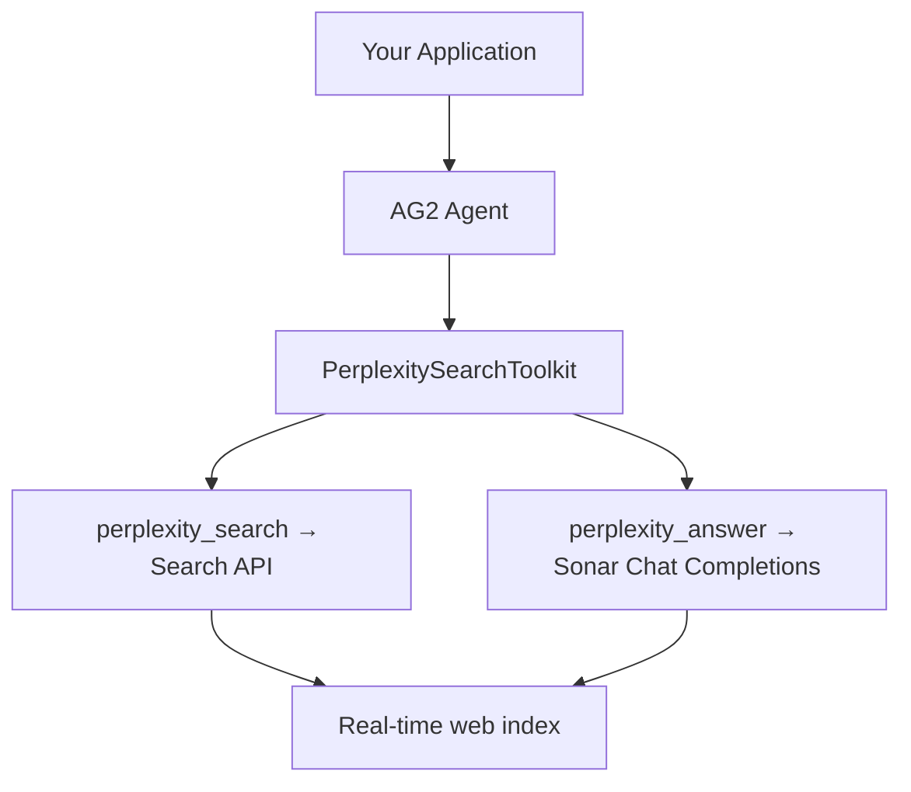

# Giving AG2 Agents Real-Time Web Access with Perplexity

This guide shows how to give [AG2](https://github.com/ag2ai/ag2) agents live web access using Perplexity's Search API and Sonar models. AG2 >= 1.0.0 ships first-party Perplexity support, so there is no adapter package to write or maintain.

## 🎯 What You'll Build

By the end of this guide, you'll have:
- ✅ An [AG2](https://github.com/ag2ai/ag2) agent with two Perplexity-backed tools
- ✅ Raw web search results via the **Search API** (no LLM hop, no extra token cost)
- ✅ Grounded answers with citations via **Sonar**
- ✅ Per-tool filtering (domains, recency, date ranges, search mode)

## 🏗️ Architecture Overview



AG2 ships first-party Perplexity support, so there is no adapter package to write or maintain. The
toolkit exposes both endpoints as tools sharing a single HTTP client, and AG2 drives the tool-calling
loop with whichever model provider the agent is configured with.

## 📋 Prerequisites

- **Python 3.10+**
- **AG2 >= 1.0.0**
- **Perplexity API key** — [get one here](https://docs.perplexity.ai/home)
- An API key for the agent's own model provider (Anthropic, OpenAI, Gemini, …)

:::info
The Perplexity tools are provider-agnostic: they run as local function tools, so they work with
**every** model provider AG2 supports — not just OpenAI-compatible ones.
:::

## 🚀 Installation

```bash
pip install "ag2[perplexity]>=1.0.0"
```

The `perplexity` extra pulls in the official `perplexityai` SDK. Add your agent's model provider
extra as well, for example:

```bash
pip install "ag2[perplexity,anthropic]>=1.0.0"
```

## ⚙️ Environment Setup

```bash
export PERPLEXITY_API_KEY="your-perplexity-api-key"
export ANTHROPIC_API_KEY="your-anthropic-api-key"
```

If `api_key` is omitted on the toolkit, the Perplexity SDK reads `PERPLEXITY_API_KEY` from the
environment automatically.

## 🧰 The Tools

| Tool | Endpoint | What it returns |
|------|----------|-----------------|
| `perplexity_search` | [Search API](https://docs.perplexity.ai/docs/search/quickstart) | Ranked title / URL / snippet / date results — no LLM hop |
| `perplexity_answer` | [Sonar Chat Completions](https://docs.perplexity.ai/docs/sonar/openai-compatibility) | LLM answer with citations, plus search results and optional images |

## 🏁 Quick Start

Passing the whole toolkit registers both tools:

```python
import asyncio
import os

from ag2 import Agent
from ag2.config import AnthropicConfig
from ag2.tools import PerplexitySearchToolkit

agent = Agent(
    "researcher",
    prompt=(
        "You research topics on the live web. "
        "Use perplexity_search to gather sources and perplexity_answer for grounded summaries."
    ),
    config=AnthropicConfig(model="claude-sonnet-4-6"),
    tools=[PerplexitySearchToolkit(api_key=os.environ["PERPLEXITY_API_KEY"])],
)


async def main() -> None:
    reply = await agent.ask("What shipped in the latest Sonar model release? Cite your sources.")
    print(reply.body)


asyncio.run(main())
```

## 🎚️ Picking a Subset of Tools

Each tool is exposed as a factory method on the toolkit. Call the method to get a ready-to-use tool,
then pass only the ones you need:

```python
toolkit = PerplexitySearchToolkit()

agent = Agent(
    "searcher",
    config=AnthropicConfig(model="claude-sonnet-4-6"),
    tools=[toolkit.search()],   # Search API only — no Sonar calls
)
```

This is the cheap path when the agent only needs sources and will do its own synthesis.

## 🔧 Per-Tool Configuration

Per-call parameters live on the factory methods, not on the toolkit:

```python
toolkit = PerplexitySearchToolkit()

search_tool = toolkit.search(
    max_results=10,
    max_tokens_per_page=512,
    search_domain_filter=["arxiv.org", "-medium.com"],  # prefix '-' to exclude
    search_recency_filter="week",                       # hour | day | week | month | year
    search_after_date_filter="1/1/2025",                # MM/DD/YYYY
    search_before_date_filter="12/31/2025",
)

answer_tool = toolkit.answer(
    model="sonar-pro",              # sonar | sonar-pro | sonar-reasoning | sonar-reasoning-pro | sonar-deep-research
    max_tokens=2000,
    search_context_size="high",     # low | medium | high
    search_mode="academic",         # web | academic | sec
    search_recency_filter="month",
    return_images=True,
    return_related_questions=True,
)

agent = Agent("researcher", config=config, tools=[search_tool, answer_tool])
```

## 🧪 Two Specialists, Two Configurations

Because parameters are bound per tool, you can give different agents differently-scoped access to the
same API — an academic researcher and a news monitor, for instance:

```python
toolkit = PerplexitySearchToolkit()

academic = Agent(
    "academic",
    prompt="You only cite peer-reviewed and preprint sources.",
    config=AnthropicConfig(model="claude-sonnet-4-6"),
    tools=[toolkit.answer(model="sonar-reasoning", search_mode="academic")],
)

news = Agent(
    "news",
    prompt="You report only on developments from the last week.",
    config=AnthropicConfig(model="claude-sonnet-4-6"),
    tools=[toolkit.search(search_recency_filter="week", max_results=10)],
)
```

## 🔁 Runtime Values with `Variable`

Every runtime parameter accepts an AG2 `Variable`, resolved from the run context at execution time
rather than fixed when the tool is built:

```python
from ag2.annotations import Variable

toolkit = PerplexitySearchToolkit()
search_tool = toolkit.search(search_recency_filter=Variable("freshness"))
```

## 🌐 Networking Options

The toolkit forwards transport settings to the shared HTTP client, and any extra keyword arguments to
the `AsyncPerplexity` SDK constructor:

```python
toolkit = PerplexitySearchToolkit(
    api_key=os.environ["PERPLEXITY_API_KEY"],
    proxy="http://localhost:8080",
    verify=True,
    timeout=30.0,
)
```

Requests made through AG2 are tagged with integration headers, so Perplexity-side usage is
attributable to AG2 automatically.

## 📎 Full Example

A runnable version of this guide lives in [`ag2_perplexity.py`](./ag2_perplexity.py).

## 📚 Resources

- [AG2 repository](https://github.com/ag2ai/ag2)
- [AG2 common tools documentation](https://docs.ag2.ai/docs/user-guide/tools/common_toolkits)
- [Perplexity Search API](https://docs.perplexity.ai/docs/search/quickstart)
- [Sonar models](https://docs.perplexity.ai/docs/sonar/openai-compatibility)
