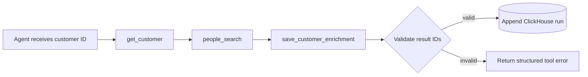

# Customer Enrichment with Agent API, People Search, and ClickHouse

This macOS-first tutorial enriches five demo customer records with public professional evidence. A focused Python CLI reads source rows from local ClickHouse, lets the Perplexity Agent API call built-in People Search, validates every cited result ID, and appends a separate enrichment run.

An LLM alone is not enough for this job. Its memory can be stale, it cannot safely access a private customer table, and free-form URLs or SQL would let untrusted output cross a data boundary.

## Features

This project exposes three narrow tools:



- `get_customer` performs a bound read and returns only the minimum identifying fields.
- `people_search` is Perplexity's live built-in professional search tool.
- `save_customer_enrichment` accepts normalized fields and result IDs, never arbitrary SQL or URLs. Application code resolves trusted URLs from structured People Search output.

Every customer gets a separate Agent API context. Source rows are never updated; a forced rerun appends history so models and evidence can be compared.

The agent orchestrates both the database and search work. It decides when to call `get_customer`, which the controller maps to an application-owned, parameter-bound ClickHouse `SELECT`; it invokes the built-in `people_search` tool itself; and it calls `save_customer_enrichment`, which the controller validates before issuing the append-only ClickHouse `INSERT`. The model never receives a raw SQL tool or permission to invent a statement. This preserves the agent workflow while keeping SQL text, credentials, evidence resolution, and write idempotency under deterministic application control.

## Cost and data boundaries

| Command kind | Network/API behavior |
|---|---|
| `uv sync`, offline tests | Downloads packages during first sync; tests make no Agent API calls |
| ClickHouse setup, reads, fixture enrichment, reset | Local Docker only |
| `doctor` | Makes one small billable Agent API request unless `--skip-api` is used |
| Live `enrich` | Spends Agent API credits; one customer run can require multiple continuation requests |

Live commands require both `PERPLEXITY_API_KEY` and `CONFIRM_LIVE_SPEND=YES`. They use zero SDK retries, persist ignored raw receipts under `.artifacts/` with mode `0600`, and never silently fall back to fixtures.

Live `enrich` also requires `--customer-id` or `--limit`, so an adapted table cannot accidentally trigger an unbounded batch.

Each customer is capped at 10 Agent API continuation requests, and each request uses `max_steps=10`. The defensive worst-case ceiling is therefore 10 requests and 100 agent steps per customer; normal runs should finish much sooner. A four-customer batch can make at most 40 continuation requests and stops with an error status when any customer reaches the ceiling.

The seed data contains three high-signal public figures, one deliberately ambiguous common name, and one fictitious identity expected to produce `not_found`. The public figures are tutorial identities and are not claimed to be Perplexity customers. Current live outcomes can differ as public profiles and search rankings change.

## 1. Install macOS prerequisites

You need macOS, Git, [Homebrew](https://brew.sh/), Docker Desktop, and `uv`. Install `uv` with `brew install uv` and Docker Desktop with `brew install --cask docker`. Open Docker Desktop once and wait for the engine to report that it is running. `uv` installs the pinned Python 3.12 runtime from `.python-version` when needed.

Verify the tools:

{/* smoke:local */}
```bash
uv --version
```

{/* smoke:docker */}
```bash
docker compose version
```

From the cookbook checkout, enter this example directory before continuing:

{/* smoke:local */}
```bash
cd "$(git rev-parse --show-toplevel)/docs/examples/customer-enrichment-agent-api"
```

## 2. Configure the project

Copy the ignored environment template:

{/* smoke:configure */}
```bash
cp .env.example .env
```

Open `.env` locally and set `PERPLEXITY_API_KEY`. Change `CONFIRM_LIVE_SPEND` to `YES` only when you intend to run the billable commands. Do not paste credentials into chat, terminal history, fixtures, screenshots, or commits. The local ClickHouse instance binds only to loopback and uses separate passwordless setup and least-privilege users; do not reuse this configuration outside the tutorial.

Install the exact lockfile:

{/* smoke:local */}
```bash
uv sync --frozen
```

## 3. Start and verify ClickHouse

The Compose file pins `clickhouse/clickhouse-server:25.8.33.6`; it never uses `latest`.

{/* smoke:docker */}
```bash
docker compose up -d
```

{/* smoke:docker */}
```bash
docker compose ps
```

Run local diagnostics first. Before setup, the schema warning is expected.

{/* smoke:docker */}
```bash
uv run customer-enrichment doctor --skip-api
```

Run the full doctor only after opting into spend. It makes one minimal request to verify the key and selected model and stores the response ID in a private receipt.

{/* smoke:live */}
```bash
uv run customer-enrichment doctor
```

## 4. Create and inspect the seed table

`setup` waits for ClickHouse, creates the schema and limited application user, and inserts only missing demo rows. It is safe to repeat.

{/* smoke:docker */}
```bash
uv run customer-enrichment setup
```

{/* smoke:docker */}
```bash
uv run customer-enrichment setup
```

{/* smoke:docker */}
```bash
uv run customer-enrichment customers
```

The five rows come from `data/demo_customers.csv`. Bill Gates, Tim Cook, and Mark Zuckerberg include company, role context, location, and an authoritative profile URL. Michael Lee at Google intentionally lacks enough context to select one person confidently. Maren Quill at the fictitious Northstar Quantum Labs is expected to produce `not_found`.

## 5. Enrich one customer and inspect every stage

This command is live and billable. The verbose trace shows sanitized custom-function arguments, People Search queries and result IDs, validation results, and timings—never hidden reasoning or secrets.

{/* smoke:live */}
```bash
uv run customer-enrichment enrich --customer-id demo-001 --verbose
```

Expected stages are `loading`, `searching`, `validating`, `writing`, and `complete`. The final block includes the actual model, every response ID in the continuation, evidence counts, and the ClickHouse run UUID.

In verbose mode, `agent tool route` identifies the simulated backend action for each tool: the bound customer `SELECT`, either live provider search or a deterministic fixture response, and the validated run-table `INSERT`.

For deterministic troubleshooting, run the same controller and database write with a sanitized fixture. The conspicuous banner means this is not evidence that live People Search worked.

{/* smoke:docker */}
```bash
uv run customer-enrichment enrich --customer-id demo-001 --force --fixture clear_match --verbose
```

## 6. Enrich the remaining batch

This command is live and billable. It processes at most four still-pending demo rows, including the intentionally ambiguous and fictitious cases, with a separate Agent API run for each.

{/* smoke:live */}
```bash
uv run customer-enrichment enrich --limit 4
```

Repeat the same command and completed rows are skipped without an Agent API call:

{/* smoke:live */}
```bash
uv run customer-enrichment enrich --limit 4
```

## 7. Inspect append-only provenance

{/* smoke:docker */}
```bash
uv run customer-enrichment results
```

Query ClickHouse directly. This proves the controller appended rows rather than mutating source customers:

{/* smoke:docker */}
```bash
docker compose exec clickhouse clickhouse-client --query "SELECT customer_id, run_id, status, actual_model, agent_response_ids, selected_source_result_id, resolved_profile_url FROM customer_enrichment.customer_enrichment_runs ORDER BY enriched_at FORMAT Vertical"
```

The stored raw JSON comes only from `people_search_results` items. Before insert, the controller confirms the save customer ID, requires normalized profile fields to be null for `ambiguous` and `not_found`, checks every selected or supporting ID against the current customer run, rejects IDs that map to conflicting results across search turns, rejects referenced URLs with non-HTTP(S) schemes, embedded credentials, whitespace, control characters, or trailing markdown artifacts, and resolves URLs and snippets from validated evidence. A fabricated, stale, conflicting, malformed, or cross-customer source is returned to the model as a structured error and is not written as a terminal result. The agent may correct a rejected save on the next continuation; after acceptance, duplicate saves are ignored. Each continuation uses `previous_response_id`, so the Agent API retains the complete run state while the application returns each local result with its original `call_id`. The controller UUID is also sent to ClickHouse as the insert deduplication token, backed by a bounded non-replicated deduplication window in the tutorial table.

## 8. Change models and compare runs

`perplexity/glm-5.3` is the exact default. Override it through `MODEL` or `--model` without editing code. Confirm the model is available to your API account first; this example uses another model shown in the current People Search documentation.

{/* smoke:live */}
```bash
MODEL=openai/gpt-5-mini uv run customer-enrichment enrich --customer-id demo-001 --force
```

Compare all versions for that customer:

{/* smoke:docker */}
```bash
docker compose exec clickhouse clickhouse-client --query "SELECT run_id, status, actual_model, people_search_queries, resolved_profile_url, enriched_at FROM customer_enrichment.customer_enrichment_runs WHERE customer_id = 'demo-001' ORDER BY enriched_at FORMAT Vertical"
```

## 9. Run deterministic tests

The default suite needs no API key and performs no network calls. The live smoke test is skipped.

{/* smoke:local */}
```bash
uv run pytest
```

The opt-in live test processes `demo-001`, verifies both custom tools plus a structured People Search item, proves result IDs and URLs match the response payload, inserts one row, and cleans up only its run UUID. It requires a running tutorial ClickHouse instance.

{/* smoke:live */}
```bash
RUN_LIVE_TESTS=1 uv run pytest -m live
```

## 10. Reset and repeat

Interactive reset asks before deleting the five demo customers and their enrichment history. For automation, pass `--yes`. Non-demo customers and their runs are preserved. Both paths restore exactly the initial five seed rows and use the setup identity, never the Agent tool user.

{/* smoke:docker */}
```bash
uv run customer-enrichment reset --yes
```

{/* smoke:docker */}
```bash
uv run customer-enrichment customers
```

To stop the local service without deleting its named volumes:

{/* smoke:teardown */}
```bash
docker compose down
```

## 11. Adapt it to a learner-owned table

Keep `customer_id` stable and map only the fields needed by `Customer` in `ClickHouseRepository.get_customer`. Keep the query text application-owned and bind every value. Do not expose private notes, contact data, payment fields, credentials, or unrelated columns to the model. Grant the runtime user only source `SELECT`, run-table `SELECT`/`INSERT`, and view `SELECT`.

You are responsible for permission, privacy notices, retention, deletion obligations, provider terms, and applicable employment, consumer-reporting, GDPR, CCPA, or other enrichment rules. People Search is for legitimate professional research, not harassment, stalking, doxxing, or unauthorized background screening.

## README smoke runner

Every fenced shell command above is classified and copied by `scripts/smoke_readme.py`. Syntax/classification checks are offline; execution modes are intentionally separate so local checks cannot start Docker or spend credits. The `live` mode requires the same explicit spend acknowledgement, verifies that ClickHouse and the tutorial schema are ready before spending, binds resume progress to the exact command list, and writes a completion sentinel to prevent accidental reruns.

{/* smoke:local */}
```bash
uv run python scripts/smoke_readme.py --mode check
```

After configuring `.env`, use `--mode docker` to start and set up ClickHouse, then `--mode live` only when you intend to make the documented billable calls. The Docker mode deliberately leaves ClickHouse running; use `--mode teardown` after live validation to execute the documented `docker compose down` command.

## Troubleshooting

- **Docker daemon is not running:** open Docker Desktop and wait until `docker compose version` and `docker info` succeed.
- **Port 8123 is already in use:** stop the conflicting service or change `CLICKHOUSE_HTTP_PORT` in `.env`; Compose and the Python client share it.
- **ClickHouse is still starting:** run `docker compose ps`. `setup` waits up to 60 seconds; inspect `docker compose logs clickhouse` if health never becomes `healthy`.
- **API key is missing or invalid:** populate the ignored `.env`. Live commands also require `CONFIRM_LIVE_SPEND=YES`; an invalid key is reported without printing it.
- **Model unavailable:** set `MODEL` to a compatible model listed in the Agent API models documentation, then run the full billable `doctor` once.
- **People Search returns no result:** `not_found` is a valid terminal result. Do not invent fields or substitute an unrelated generic web result.
- **Results changed since this tutorial:** public profiles and search ranking change. Inspect current result IDs and evidence; tests deliberately avoid exact live titles, URLs, and statuses.
- **Agent reaches the step limit:** the project explicitly uses `max_steps=10`. Narrow the seed identity or choose a compatible model; do not raise the limit blindly for a learner batch.
- **Agent response is incomplete or a continuation fails:** the controller appends an `error` run and exits non-zero; it never converts a partially completed loop into a terminal match.
- **Source validation rejects save:** verbose mode shows the rejected ID. The agent may correct it on the next continuation; otherwise the controller appends a sanitized `error` attempt.
- **Reproduce URL rejection without spending:** use the sanitized `corrected_invalid_url` fixture with the documented fixture command in place of `clear_match`; its first save cites a markup-tainted URL and its second save removes it.
- **Customer already enriched:** this is expected. Use `--force` only when you intentionally want another append-only version.

## Project map

```text
data/demo_customers.csv            Public-only tutorial seeds
sql/schema.sql                     Source, append-only run table, latest view
sql/users.sql                      Least-privilege application grants
src/customer_enrichment/agent.py   Direct Agent API continuation loop
src/customer_enrichment/evidence.py Structured result-ID validation
src/customer_enrichment/clickhouse.py Bound reads and append-only writes
tests/fixtures/                     Sanitized deterministic Agent responses
tests/test_live_smoke.py            Explicitly gated live provenance test
```

## References

- [Perplexity Agent API quickstart](https://docs.perplexity.ai/docs/agent-api/quickstart)
- [Give an Agent API run tools](https://docs.perplexity.ai/docs/agent-api/building-agents/give-it-tools)
- [People Search](https://docs.perplexity.ai/docs/agent-api/tools/people-search)
- [Function calling end to end](https://docs.perplexity.ai/docs/cookbook/articles/function-calling-e2e/README)
- [Create Agent Response reference](https://docs.perplexity.ai/api-reference/agent-post)
- [ClickHouse Docker setup](https://clickhouse.com/docs/get-started/setup/self-managed/docker)
- [ClickHouse Connect Python integration](https://clickhouse.com/integrations/python)
- [ClickHouse Connect parameter binding](https://clickhouse.com/docs/integrations/language-clients/python/driver-api)
